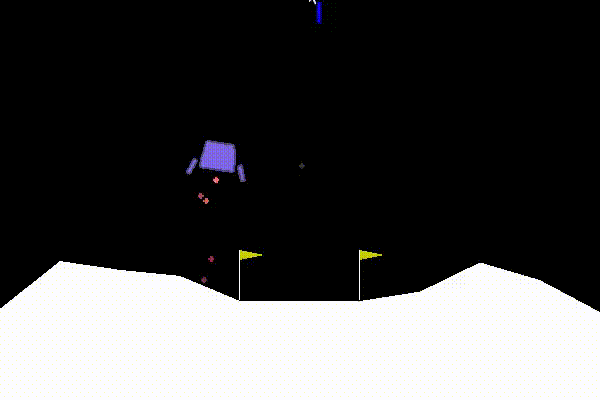

# OpenAI Lunar Lander v2
Srikanth Kilaru

Northwestern University (Spring 2018)

## Overview
The Lunar Lander v2 is an OpenAI's Gym is a toolkit for developing and comparing reinforcement learning algorithms. One such environment is the Lunar Lander v2 environment. In this environment the Landing pad is always at coordinates (0,0). Coordinates are the first two numbers in state vector. Reward for moving from the top of the screen to landing pad and zero speed is about 100..140 points. If lander moves away from landing pad it loses reward back. Episode finishes if the lander crashes or comes to rest, receiving additional -100 or +100 points. Each leg ground contact is +10. Firing main engine is -0.3 points each frame. Solved is 200 points. Landing outside landing pad is possible. Fuel is infinite, so an agent can learn to fly and then land on its first attempt. Four discrete actions available: do nothing, fire left orientation engine, fire main engine, fire right orientation engine.

## Goal
The goal is obviously to land the Lunar Lander between the yellow flags without crashing it.

 
Animation of the successful lunar landing

A Deep Q learning algorithm is used to achieve this goal. You can see the source code [here](https://github.com/srikanth-kilaru/final-project/blob/master/ll-v2.py)
 
## Installation
Please see here for installing [OpenAI Gym](https://gym.openai.com/docs/)
